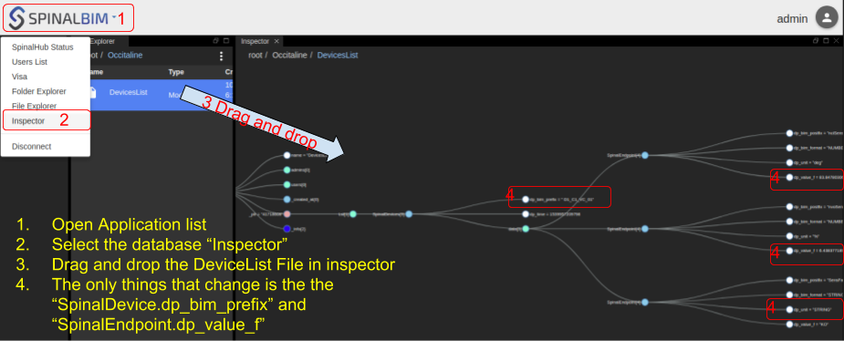

# spinal-organ-endpoints-tcp-server

The spinal-organ-endpoints-tcp-server is a simple organ connected to a spinalsystem and listens to a TCP port.
It waits for a connection of a client which send a Json via TCP.
The organ receive the TCP message parse it and then update a list in the virtual filesystem. 

# installation

Git clone the repository, then install the npm dependencies
```sh
git clone https://github.com/spinalcom/spinal-organ-endpoints-tcp-server
cd spinal-organ-endpoints-tcp-server
npm i
```

# configuration

Edit the configuration file so it can reach an existing spinalcom system, or you can use shell ENV variables.
You can also set here the TCP port which the server listen to.
```js
module.exports.SPINAL_USER_NAME = process.env.SPINAL_USER_NAME || "admin";
module.exports.SPINAL_PASSWORD = process.env.SPINAL_PASSWORD || "JHGgcz45JKilmzknzelf65ddDadggftIO98P";
module.exports.SPINALHUB_IP = process.env.SPINALHUB_IP || "localhost";
module.exports.SPINALHUB_PORT = process.env.SPINALHUB_PORT || 7777;
module.exports.SPINAL_FILE_PATH = process.env.SPINAL_FILE_PATH || "Occitaline/DevicesList";

module.exports.TCP_PORT_LISTEN = process.env.TCP_PORT_LISTEN || 7070; // Actual TCP port
module.exports.DEBUG = process.env.DEBUG || true; // print the TCP events
```


# Data Models

## SpinalDevices
Attributes| type |Comments
-|-|-
dp_bim_prefix | String | Unique identifier used to research if already in the Lst Model
dp_time | Number | a Timestamp
data | Array.< SpinalEndpoint >|
## SpinalEndpoint
Attributes| type| Comments
-|-|-
dp_bim_postfix| String | Unique identifier used to research if already in the fileSystem
dp_bim_format| String|
dp_unit| String|
dp_value_f| String \| Number|

# run the organ

```sh
node index.js
# or if you want to set the TCP_PORT_LISTEN via an ENV variable
# $> TCP_PORT_LISTEN=6545 node index.js
```
# Client test script 
A simple client is made to test the organ
```sh
cd test_client
node test_client_occitaline.js
```

object sent
```js
const obj = {
  dp_bim_prefix: " D1_C1_VC_01",
  dp_time: Date.now(),
  data: [
    {
      dp_bim_postfix: "nciSensOffTemp",
      dp_bim_format: "NUMBER",
      dp_value_f: Math.random() * 100,
      dp_unit: "deg"
    },
    {
      dp_bim_postfix: "nvoSensFanSpeed_value",
      dp_bim_format: "NUMBER",
      dp_value_f: Math.random() * 100,
      dp_unit: "%"
    },
    {
      dp_bim_postfix: "SensFanStatus",
      dp_bim_format: "STRING",
      dp_value_f: Math.floor(Math.random() * 2) === 1 ? "OK" : "KO",
      dp_unit: "STRING"
    }
  ]
}
```
## check the value in Admin
each time the `Client test script` run the client send a data to the organ tcp server then update the Model in the FileSystem. The data sent can be viewed in the admin browser viewer `http://SPINALSYSTEMHOSTNAME/html/admin/`, the default File path is `/Occitaline/DevicesList`




* * *

## API Documentations

## Classes

<dl>
<dt><a href="#ServerProcess">ServerProcess</a></dt>
<dd></dd>
<dt><a href="#SpinalConnection">SpinalConnection</a></dt>
<dd></dd>
<dt><a href="#TcpServer">TcpServer</a></dt>
<dd></dd>
</dl>

## Typedefs

<dl>
<dt><a href="#onConnectCallback">onConnectCallback</a> : <code>function</code></dt>
<dd><p>callback called on new incoming client.</p>
</dd>
<dt><a href="#onDataCallback">onDataCallback</a> : <code>function</code></dt>
<dd><p>callback called on incoming data from clients.</p>
</dd>
<dt><a href="#onCloseCallback">onCloseCallback</a> : <code>function</code></dt>
<dd><p>callback called when a client disconnect.</p>
</dd>
</dl>

<a name="ServerProcess"></a>

## ServerProcess
**Kind**: global class  

* [ServerProcess](#ServerProcess)
    * _instance_
        * [.release()](#ServerProcess+release)
        * [.onConnect(socket)](#ServerProcess+onConnect)
        * [.onData(socket, data)](#ServerProcess+onData)
        * [.onClose(socket)](#ServerProcess+onClose)
        * [.onModelsChange()](#ServerProcess+onModelsChange)
    * _static_
        * [.ServerProcess](#ServerProcess.ServerProcess)
            * [new ServerProcess(config, model)](#new_ServerProcess.ServerProcess_new)

<a name="ServerProcess+release"></a>

### serverProcess.release()
release the listenting

**Kind**: instance method of [<code>ServerProcess</code>](#ServerProcess)  
<a name="ServerProcess+onConnect"></a>

### serverProcess.onConnect(socket)
**Kind**: instance method of [<code>ServerProcess</code>](#ServerProcess)  

| Param | Type |
| --- | --- |
| socket | <code>net.Socket</code> | 

<a name="ServerProcess+onData"></a>

### serverProcess.onData(socket, data)
**Kind**: instance method of [<code>ServerProcess</code>](#ServerProcess)  

| Param | Type |
| --- | --- |
| socket | <code>net.Socket</code> | 
| data | <code>string</code> | 

<a name="ServerProcess+onClose"></a>

### serverProcess.onClose(socket)
**Kind**: instance method of [<code>ServerProcess</code>](#ServerProcess)  

| Param | Type |
| --- | --- |
| socket | <code>net.Socket</code> | 

<a name="ServerProcess+onModelsChange"></a>

### serverProcess.onModelsChange()
method called by spinalCore when some data are modified in the model

**Kind**: instance method of [<code>ServerProcess</code>](#ServerProcess)  
<a name="ServerProcess.ServerProcess"></a>

### ServerProcess.ServerProcess
**Kind**: static class of [<code>ServerProcess</code>](#ServerProcess)  
<a name="new_ServerProcess.ServerProcess_new"></a>

#### new ServerProcess(config, model)
Creates an instance of ServerProcess.


| Param | Type | Description |
| --- | --- | --- |
| config | <code>object</code> | must have an attribut `TCP_PORT_LISTEN` |
| model | <code>Model</code> |  |

<a name="SpinalConnection"></a>

## SpinalConnection
**Kind**: global class  

* [SpinalConnection](#SpinalConnection)
    * _instance_
        * [.init()](#SpinalConnection+init) ⇒
        * [.loadOrStore(path, ModelToStoreIfNotExist)](#SpinalConnection+loadOrStore) ⇒ <code>Promise</code>
    * _static_
        * [.SpinalConnection](#SpinalConnection.SpinalConnection)
            * [new SpinalConnection(config)](#new_SpinalConnection.SpinalConnection_new)

<a name="SpinalConnection+init"></a>

### spinalConnection.init() ⇒
test the connection to the hub and then create a FileSystem instance

**Kind**: instance method of [<code>SpinalConnection</code>](#SpinalConnection)  
**Returns**: Promise  
<a name="SpinalConnection+loadOrStore"></a>

### spinalConnection.loadOrStore(path, ModelToStoreIfNotExist) ⇒ <code>Promise</code>
**Kind**: instance method of [<code>SpinalConnection</code>](#SpinalConnection)  
**Returns**: <code>Promise</code> - resolve Model  

| Param | Type |
| --- | --- |
| path | <code>\*</code> | 
| ModelToStoreIfNotExist | <code>\*</code> | 

<a name="SpinalConnection.SpinalConnection"></a>

### SpinalConnection.SpinalConnection
**Kind**: static class of [<code>SpinalConnection</code>](#SpinalConnection)  
<a name="new_SpinalConnection.SpinalConnection_new"></a>

#### new SpinalConnection(config)
Creates an instance of SpinalConnection.


| Param | Type |
| --- | --- |
| config | <code>\*</code> | 

<a name="TcpServer"></a>

## TcpServer
**Kind**: global class  
<a name="new_TcpServer_new"></a>

### new TcpServer(config, onConnect, onData, onClose)
Private function to init the events given in the constructor


| Param | Type | Description |
| --- | --- | --- |
| config | <code>object</code> | must have an attribut `TCP_PORT_LISTEN` |
| onConnect | [<code>onConnectCallback</code>](#onConnectCallback) | callback called on new incoming client |
| onData | [<code>onDataCallback</code>](#onDataCallback) | callback called on incoming data from clients |
| onClose | [<code>onCloseCallback</code>](#onCloseCallback) | callback called when a client disconnect |

<a name="onConnectCallback"></a>

## onConnectCallback : <code>function</code>
callback called on new incoming client.

**Kind**: global typedef  

| Param | Type |
| --- | --- |
| socket | <code>net.Socket</code> | 

<a name="onDataCallback"></a>

## onDataCallback : <code>function</code>
callback called on incoming data from clients.

**Kind**: global typedef  

| Param | Type |
| --- | --- |
| socket | <code>net.Socket</code> | 
| data | <code>String</code> | 

<a name="onCloseCallback"></a>

## onCloseCallback : <code>function</code>
callback called when a client disconnect.

**Kind**: global typedef  

| Param | Type |
| --- | --- |
| socket | <code>net.Socket</code> | 

* * *